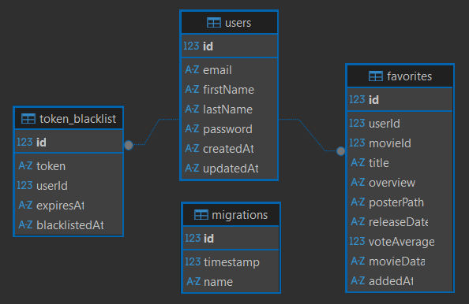

# CodigoDelSur Backend API

API REST desarrollada con Node.js + Express + TypeScript + SQLite para la evaluación técnica de CodigoDelSur. Sistema de autenticación JWT, búsqueda de películas vía TheMovieDB API y gestión de favoritos.

## 🚀 Características

- Registro y autenticación de usuarios con JWT + token blacklist (logout)
- Búsqueda de películas desde TheMovieDB API
- Gestión de películas favoritas por usuario
- Documentación automática con Swagger
- Tests unitarios con Jest
- TypeORM con migraciones
- Cron job para limpieza de tokens expirados

## 🛠 Stack Tecnológico

**Backend:** Node.js 18 • Express • TypeScript  
**Base de Datos:** SQLite3 • TypeORM  
**Autenticación:** JWT • bcrypt  
**Documentación:** Swagger  
**Testing:** Jest  
**Containerización:** Docker

## ⚡ Inicio Rápido

### Opción 1: Docker (Recomendado)

```bash
# Clonar repositorio
git clone <repository-url>
cd NodejsCDS

# Iniciar con Docker
docker compose up --build -d

# Ver logs
docker compose logs -f app
```

**API disponible en:** http://localhost:8000  
**Documentación:** http://localhost:8000/api-docs

### Opción 2: Local

```bash
# Instalar dependencias
npm install

# Desarrollo (con hot-reload)
npm run dev

# Producción
npm run build
npm start
```

## 📡 Endpoints Principales

### Autenticación
- `POST /api/register` - Registrar usuario
- `POST /api/login` - Iniciar sesión
- `POST /api/logout` - Cerrar sesión (invalidar token, requiere el token en el header)

### Películas (requiere autenticación)
- `GET /api/movies?keyword=fight` - Buscar películas

### Favoritos (requieren autenticación)
- `GET /api/favorites` - Listar favoritos
- `POST /api/favorites` - Agregar favorito
- `DELETE /api/favorites/:movieId` - Eliminar favorito

## 🧰 Scripts Disponibles

```bash
npm run dev          # Desarrollo con hot-reload
npm run build        # Compilar TypeScript
npm start            # Servidor producción (con migraciones)
npm test             # Ejecutar tests
npm run lint         # Verificar código
npm run lint:fix     # Corregir errores automáticamente
npm run format       # Formatear código con Prettier

# Migraciones TypeORM
npm run migration:create src/db/migrations/MigrationName  # Crear migración
npm run migration:run     # Ejecutar migraciones pendientes
npm run migration:revert  # Revertir última migración
```

## 🏗 Arquitectura

- **TypeORM** con entidades y migraciones
- **Inyección de Dependencias** en servicios
- **Separación en capas:** Controllers → Services → Repositories
- **Clean Code** con TypeScript strict mode
- **Cron Jobs** para tareas programadas (limpieza de tokens)

### Diagrama de Base de Datos



**Tablas:** `token_blacklist`, `users`, `favorites`, `migrations`

### 🔍 Inspeccionar Base de Datos

```bash
# Copiar BD del container a local
docker cp codigodelsur-backend:/app/src/db/database.sqlite ./database.sqlite
```

Luego abrir `database.sqlite` con DBeaver, DB Browser o cualquier cliente SQLite.

## 🧪 Testing

```bash
# Ejecutar todos los tests
npm test

# Tests específicos
npm test -- FavoriteController.test.ts
npm test -- MovieController.test.ts
```

**Cobertura:** 17 tests unitarios pasando
- FavoriteController (12 tests)
- MovieController (5 tests)

## 📚 Documentación

- [Swagger UI](http://localhost:8000/api-docs) - Documentación interactiva
- [OpenAPI JSON](http://localhost:8000/api-docs.json) - Especificación OpenAPI
- [Postman Collection](postman_collection.json) - Colección de pruebas Postman
